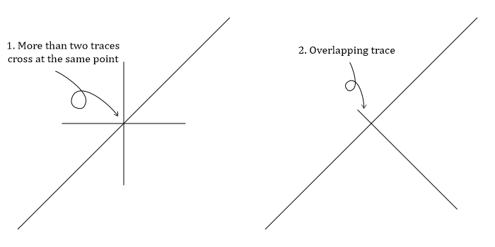
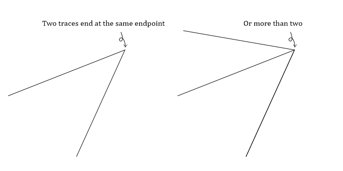
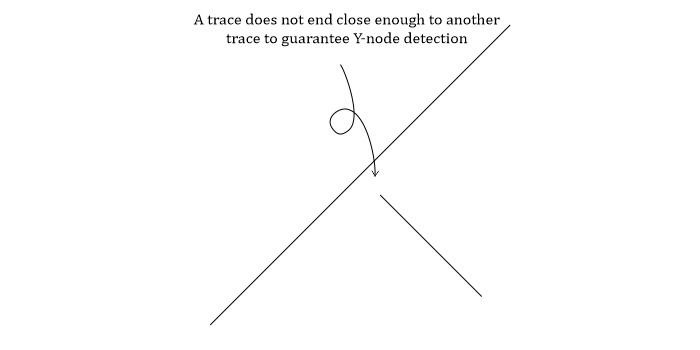
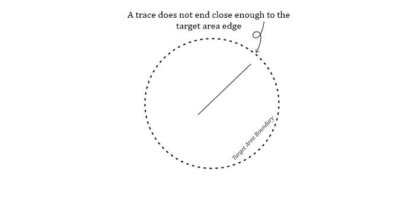
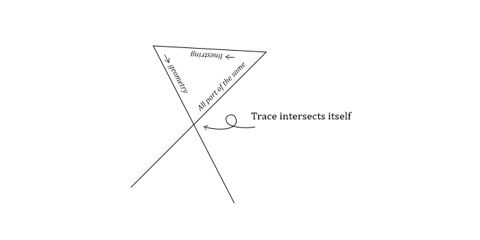
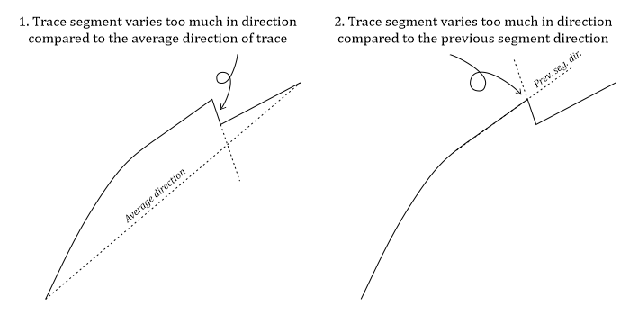

# Reference

The error string is put into the error column of the validated trace data.
Each error string is explained below. Possible automatic fixing is indicated
by the checkmarks:

No automatic fixing:

~~~
* [ ] Automatic fix
~~~

Some cases can be automatically fixed:

~~~
* [o] Automatic fix
~~~

All cases can be automatically fixed:

~~~
* [X] Automatic fix
~~~

# GeomTypeValidator

The error string is:

~~~python
"GEOM TYPE MULTILINESTRING"
~~~

The error is caused by the geometry type which is wrong: MultiLineString
instead of LineString.

MultiLineString can consist of multiple LineStrings i.e. a MultiLineString can
consist of disjointed traces. A LineString only consists of a single continuous
trace.

~~~
* [o] Automatic fix:
  * Mergeable MultiLineStrings
  * MultiLineStrings with a single LineString
~~~

Most of the time MultiLineStrings are created instead of LineStrings by the
GIS-software and the MultiLineStrings actually only consist of a single
LineString and conversion from a MultiLineString with a single LineString can
be done automatically. If the MultiLineString does consist of multiple
LineStrings they can be automatically merged if they are not disjointed i.e.
the contained LineStrings join together into a single LineString. If they
cannot be automatically merged no automatic fix is performed and the error is
kept in the error column and the user should fix the issue.

# MultiJunctionValidator

The error string is:

~~~python
"MULTI JUNCTION"
~~~

Three error types can occur in digitization resulting in this error string:

1. More than two traces must not cross in the same point or too close to the
   same point.
2. An overlapping Y-node i.e. a trace overlaps the trace it "is supposed" to end
   at too much.
3. `V NODE` errors might also be detected as `MULTI JUNCTION` errors.

~~~
* [ ] Automatic fix
~~~

Fix the error manually by making sure neither of the above rules are broken.

# VNodeValidator

The error string is:

~~~python
"V NODE"
~~~

Two traces end at the same point or close enough to be interpreted as the same
endpoint.

~~~
* [ ] Automatic fix
~~~

Fix by making sure two traces never end too near to each other.

# MultipleCrosscutValidator

The error string is:

~~~python
"MULTIPLE CROSSCUTS"
~~~

Two traces cross each other more than two times i.e. they have geometrically
more than two common coordinate points.

~~~
* [ ] Automatic fix
~~~

Fix by decreasing the number of crosses to a maximum of two between two traces.

# UnderlappingSnapValidator

The error string is:

~~~python
"UNDERLAPPING SNAP"
~~~

Or:

~~~python
"OVERLAPPING SNAP"
~~~

Underlapping error can occur when a trace ends very close to another trace but
not near enough. The abutting might not be registered as a Y-node.

Overlapping error can occur when a trace overlaps another only very slightly
resulting in a dangling end. Such dangling ends might not be registered as
Y-nodes and might cause spatial/topological analysis problems later.

Overlapping snap might also be registered as a `MULTI JUNCTION` error.

~~~
* [ ] Automatic fix
~~~

Fix by more accurately snapping the trace to the other trace.

# TargetAreaSnapValidator

The error string is:

~~~python
"TRACE UNDERLAPS TARGET AREA"
~~~

A trace ends very close to the edge of the target area but not close enough.
The abutting might not be registered as a E-node i.e. a trace endpoint that
ends at the target area. E-nodes indicate that the trace length is
undetermined.

~~~
* [ ] Automatic fix
~~~

Fix by extending the trace over the target area. The analyses typically crop
the traces to the target area so there's very little reason not to always
extend over the target area edge.

# GeomNullValidator

The error string is:

~~~python
"NULL GEOMETRY"
~~~

Rows with geometry set to None or equivalent type that is not a valid GIS geometry or
rows with empty geometries.

These rows could be automatically removed but these are most likely rare
occurrences and deleting the row would cause all attribute data associated with
the row to be consequently removed.

~~~
* [ ] Automatic fix
~~~

Fix by deleting the row or creating a geometry for the row. GIS software can be
fickle with these, make sure that if you create a new geometry it gets
associated to the row in question.

# StackedTracesValidator

The error string is:

~~~python
"STACKED TRACES"
~~~

Two (or more) traces are stacked partially or completely on top of each other.
Also finds cases in which two traces form a very small triangle intersection

~~~
* [ ] Automatic fix
~~~

Fix by editing traces do that they do not stack or intersect in a way to create
extremely small triangles.

# SimpleGeometryValidator

The error string is:

~~~python
"CUTS ITSELF"
~~~

A trace intersects itself.

~~~
* [ ] Automatic fix
~~~

Fix by removing self-intersections.

# SharpCornerValidator

## UNDER DEVELOPMENT

The error string is:

~~~python
"SHARP TURNS"
~~~

A lineament or fracture trace should not make erratic turns and the trace
should be sublinear. The exact limit on of what is erratic and what is not is
**completely open to interpretation and therefore the resulting errors are
subjective**. But if a segment of a trace has a direction change of over 180
degrees compared to the previous there's probably no natural way for a natural
bedrock structure to do that.

~~~
* [ ] Automatic fix
~~~

Fix by making less sharp turns and making sure the trace is sublinear.
